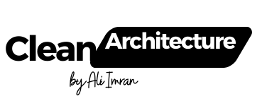

# Use Clean Architecture In this Project.  
 
### Short History
- Applications that follow the `Dependency Inversion Principle` as well as the `Domain-Driven Design (DDD)` 
principles tend to arrive at a similar architecture.

- This architecture has gone by many names over the years.One of the first names was Hexagonal Architecture, followed by Ports-and-Adapters. 

- More recently, it's been cited as the Onion Architecture or Clean Architecture. 
The latter name, Clean Architecture, is used as the name for this architecture in this e-book.
